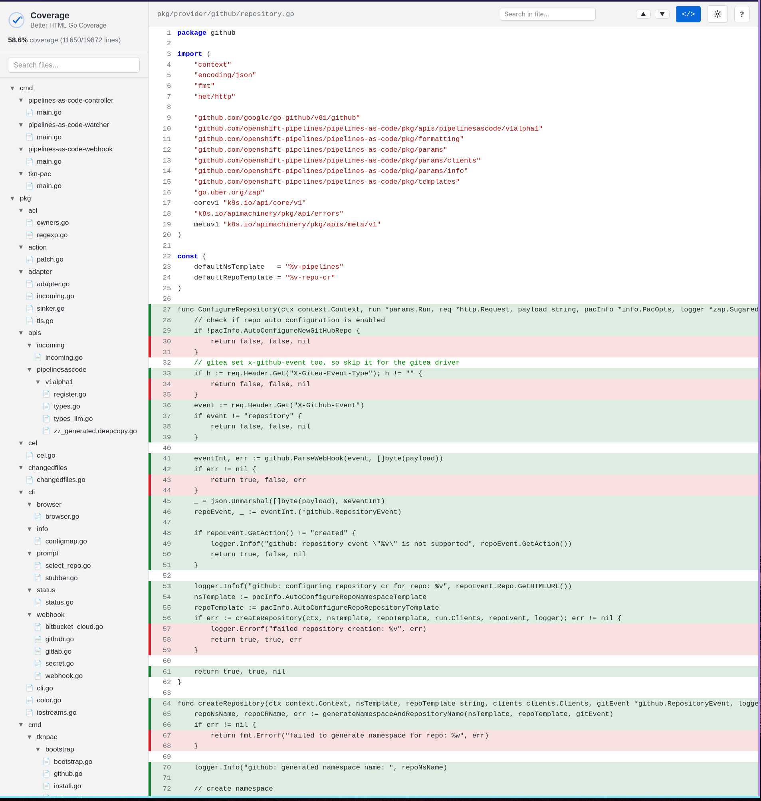

# go-better-html-coverage


Better HTML Go Coverage - Single-file HTML coverage reports for Go.



## Features

- Single self-contained HTML file
- File tree with search (Ctrl+P)
- In-file search with highlighting (Ctrl+F)
- Syntax highlighting for Go code (via CDN)
- Dark/light theme toggle
- Keyboard shortcuts (press ? for help)
- Auto-opens in browser

## Install

```bash
go install github.com/chmouel/go-better-html-coverage@latest
```

## Usage

```bash
go test -coverprofile=coverage.out ./...
go-better-html-coverage -profile coverage.out -o coverage.html
```

## Flags

| Flag | Default | Description |
|------|---------|-------------|
| `-profile` | `coverage.out` | Coverage profile path |
| `-o` | `coverage.html` | Output HTML file |
| `-src` | `.` | Source root directory |
| `-no-syntax` | `false` | Disable syntax highlighting by default |
| `-n` | `false` | Do not open browser |

## Copyright

[Apache-2.0](./LICENSE)

## Authors

### Chmouel Boudjnah

- Fediverse - <[@chmouel@chmouel.com](https://fosstodon.org/@chmouel)>
- Twitter - <[@chmouel](https://twitter.com/chmouel)>
- Blog  - <[https://blog.chmouel.com](https://blog.chmouel.com)>
